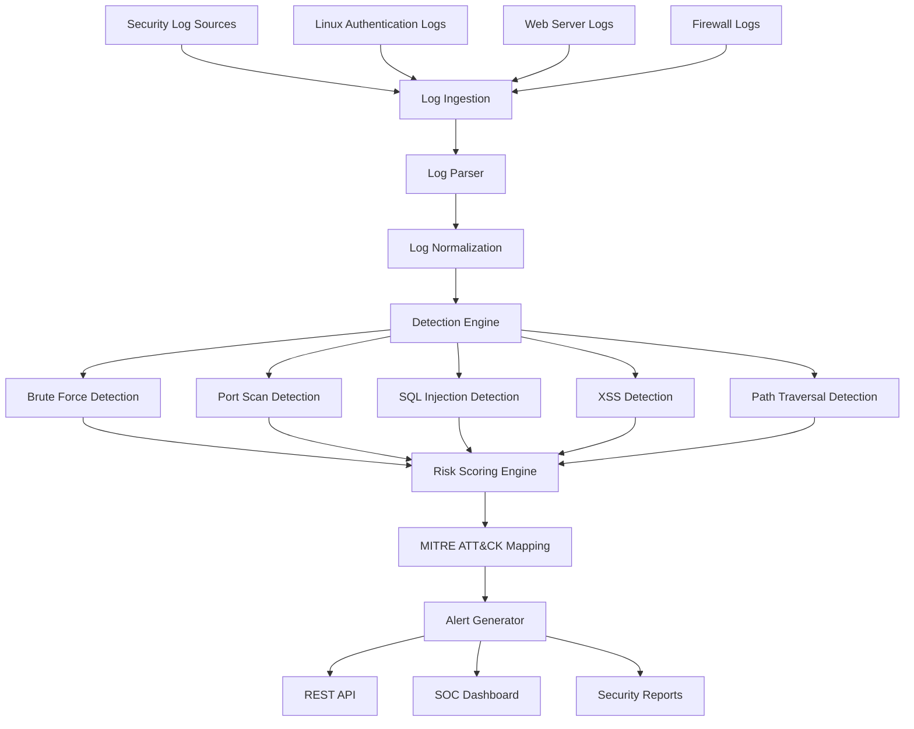

# 🛡️ SOC Log Analyzer


An automated **Security Operations Center (SOC) Log Analysis and Threat Detection Platform** designed to analyze security logs, identify suspicious activities, detect common attack patterns, calculate risk levels, and generate actionable security alerts.

The system processes **authentication logs, web server logs, and firewall logs** through a modular security detection engine. Security events are normalized, analyzed, correlated, assigned severity levels, and mapped to relevant **MITRE ATT&CK techniques**.

The platform is designed to provide security analysts with a centralized view of security events through a **SOC-style dashboard, REST API, alert engine, and security reporting system**.

---

## 🚀 Key Features

- ⚡ **Security Log Analysis:** Parses authentication, web server, and firewall logs to extract meaningful security events.

- 📂 **Multi-Format Log Parsing:** Converts different raw log formats into a normalized security event structure.

- 🔴 **Brute-Force Detection:** Detects repeated failed authentication attempts from suspicious source IP addresses.

- 🌐 **Port Scan Detection:** Identifies a source IP attempting connections across multiple ports.

- 💉 **SQL Injection Detection:** Detects common SQL injection patterns inside HTTP requests and parameters.

- 🧬 **XSS Detection:** Identifies suspicious Cross-Site Scripting payloads in web requests.

- 📁 **Path Traversal Detection:** Detects directory traversal attempts such as `../` and suspicious file access patterns.

- 🚨 **Threat Alert Generation:** Generates structured alerts containing attack type, source IP, severity, timestamp, risk score, and evidence.

- 📊 **Risk Scoring:** Calculates security risk based on attack type, frequency, severity, and related events.

- 🎯 **MITRE ATT&CK Mapping:** Maps detected behaviors to relevant MITRE ATT&CK techniques.

- 🔗 **Event Correlation:** Correlates multiple related events to identify larger attack patterns.

- 📈 **SOC Dashboard:** Provides a centralized view of events, threats, suspicious IPs, severity levels, and alerts.

- 💻 **REST API:** Provides programmatic access to log analysis, detection results, alerts, and statistics.

- 📄 **Security Reports:** Generates structured JSON and CSV reports for security investigation and analysis.

---

## 🧠 System Architecture & Data Flow



---

## ⚙️ How It Works

The SOC Log Analyzer follows a multi-stage security analysis pipeline.

### 1. 📥 Log Ingestion

The system receives security logs from multiple sources, including:

- Linux authentication logs
- Web server logs
- Firewall logs

The incoming logs are passed to the processing pipeline for analysis.

### 2. 🔍 Log Parsing

Raw log entries are parsed to extract important security information such as:

- Timestamp
- Source IP address
- Destination IP address
- Username
- Port
- HTTP method
- Requested URL
- Status code
- Event type

### 3. 🧹 Log Normalization

Different log formats are converted into a common event structure.

This allows the detection engine to process events consistently regardless of their original source.

### 4. 🧠 Threat Detection

The detection engine examines normalized events and searches for suspicious patterns.

The detection modules include:

- Brute-force attacks
- Port scanning
- SQL injection
- Cross-site scripting
- Path traversal
- Suspicious authentication activity

### 5. 📊 Risk Scoring

Each detected event receives a risk score based on factors such as:

- Attack type
- Severity
- Frequency
- Number of related events
- Correlated activity

### 6. 🎯 MITRE ATT&CK Mapping

Detected attack behaviors are mapped to relevant **MITRE ATT&CK techniques**.

This provides additional context to help security analysts understand the observed behavior.

### 7. 🚨 Alert Generation

When suspicious activity is detected, the system generates a structured alert containing:

- Alert ID
- Timestamp
- Source IP
- Attack type
- Severity
- Risk score
- Evidence
- MITRE ATT&CK mapping
- Alert status

### 8. 🔗 Event Correlation

Multiple related events can be correlated to identify larger attack patterns.

Example:

```text
Failed Login
     ↓
Failed Login
     ↓
Failed Login
     ↓
Successful Login
     ↓
Suspicious Activity
     ↓
Security Alert
```

### 9. 📈 SOC Dashboard

Processed security information is displayed through a centralized SOC dashboard.

The dashboard can provide:

- Total events
- Detected threats
- Critical alerts
- High-risk events
- Suspicious IP addresses
- Attack categories
- Recent alerts
- Risk statistics

### 10. 🔌 REST API

The FastAPI backend provides REST endpoints that allow other applications and security tools to interact with the platform.

---

## 🔐 Detection Capabilities

The detection engine focuses on common attack patterns and suspicious security behaviors.

| Detection | Description | Severity |
|---|---|---|
| 🔴 SSH Brute Force | Detects repeated failed authentication attempts from the same source IP. | HIGH |
| 🌐 Port Scanning | Identifies a source IP attempting connections across multiple ports. | HIGH |
| 💉 SQL Injection | Detects common SQL injection patterns in HTTP requests and parameters. | CRITICAL |
| 🧬 Cross-Site Scripting | Identifies suspicious JavaScript and script injection payloads. | HIGH |
| 📂 Path Traversal | Detects attempts to access files outside the intended directory. | HIGH |
| 🔎 Suspicious URL Access | Identifies requests targeting sensitive or commonly attacked endpoints. | MEDIUM |
| 🔐 Suspicious Authentication | Detects unusual authentication activity and repeated login failures. | MEDIUM |
| 🚨 Event Correlation | Correlates related events to identify larger attack patterns. | HIGH |

---

## 🔴 SSH Brute-Force Detection

The system tracks authentication failures by source IP and identifies repeated failures within a defined time window.

Example:

```text
192.168.1.50 → Failed Login
192.168.1.50 → Failed Login
192.168.1.50 → Failed Login
192.168.1.50 → Failed Login
192.168.1.50 → Failed Login

Detection: SSH Brute Force
Severity: HIGH
```

---

## 🌐 Port Scan Detection

The system monitors connection attempts and identifies hosts that probe multiple ports within a short period.

Example:

```text
192.168.1.50 → Port 21
192.168.1.50 → Port 22
192.168.1.50 → Port 23
192.168.1.50 → Port 80
192.168.1.50 → Port 443

Detection: Possible Port Scan
Severity: HIGH
```

---

## 💉 SQL Injection Detection

The analyzer searches HTTP requests for suspicious SQL patterns that may indicate an attempt to manipulate backend database queries.

Example patterns:

```text
' OR 1=1
UNION SELECT
DROP TABLE
```

---

## 🧬 Cross-Site Scripting Detection

The system identifies suspicious script injection patterns in web requests.

Example:

```text
<script>alert(1)</script>
```

---

## 📂 Path Traversal Detection

The analyzer detects directory traversal patterns that attempt to access files outside the intended application directory.

Example:

```text
../../../../etc/passwd
```

---

## 🔎 Suspicious URL Detection

Requests targeting sensitive or commonly attacked endpoints can be flagged for investigation.

Examples:

```text
/.env
/admin
/wp-admin
/phpmyadmin
/config
```

---

## 📊 Risk Scoring & Severity

The system categorizes security events according to their calculated risk level.

| Severity | Risk Score | Description |
|---|---:|---|
| 🟢 LOW | 0–29 | Informational or low-risk activity |
| 🟡 MEDIUM | 30–59 | Suspicious activity requiring monitoring |
| 🟠 HIGH | 60–79 | Significant activity requiring investigation |
| 🔴 CRITICAL | 80–100 | Severe activity requiring immediate investigation |

Risk scoring considers factors such as:

- Detection type
- Event severity
- Event frequency
- Related security events
- Correlated attack activity

---

## 🎯 MITRE ATT&CK Mapping

Detected security behaviors can be mapped to relevant MITRE ATT&CK techniques.

| Detection | ATT&CK Context |
|---|---|
| SSH Brute Force | Credential Access |
| Port Scanning | Network Service Scanning |
| SQL Injection | Exploitation of Public-Facing Application |
| XSS | Exploitation for Client Execution |
| Path Traversal | File and Directory Discovery |

MITRE ATT&CK mapping provides additional context for security analysts during investigation and incident response.

---

## 🗂️ Normalized Event Structure

Security events are converted into a consistent structure before detection.

Example:

```json
{
  "timestamp": "2026-08-25T10:30:00",
  "source_ip": "192.168.1.50",
  "event_type": "authentication_failure",
  "username": "admin",
  "severity": "HIGH",
  "risk_score": 75
}
```

A normalized event structure allows different log sources to be processed by the same detection engine.

---

## 🚨 Security Alert Structure

Generated alerts contain the information required for investigation.

Example:

```json
{
  "alert_id": "ALERT-0001",
  "timestamp": "2026-08-25T10:35:00",
  "source_ip": "192.168.1.50",
  "attack_type": "SSH Brute Force",
  "severity": "HIGH",
  "risk_score": 82,
  "evidence": "Multiple failed authentication attempts",
  "status": "OPEN"
}
```

---

## 🛠️ Technology Stack

### Backend

- Python
- FastAPI
- Uvicorn
- Pydantic

### Security Analysis

- Python Regex
- Rule-Based Detection
- Event Correlation
- Risk Scoring
- MITRE ATT&CK Mapping

### Database

- SQLite

### Frontend

- HTML5
- CSS3
- JavaScript
- SOC Dashboard Interface

### Reports & Data

- JSON
- CSV

---

## 📁 Project Structure

```text
soc-log-analyzer/
│
├── app.py
├── requirements.txt
├── README.md
│
├── data/
│   ├── auth_logs/
│   ├── web_logs/
│   └── firewall_logs/
│
├── src/
│   ├── parser/
│   │   ├── auth_parser.py
│   │   ├── web_parser.py
│   │   └── firewall_parser.py
│   │
│   ├── detection/
│   │   ├── brute_force.py
│   │   ├── port_scan.py
│   │   ├── sql_injection.py
│   │   ├── xss.py
│   │   └── path_traversal.py
│   │
│   ├── scoring/
│   │   └── risk_engine.py
│   │
│   ├── correlation/
│   │   └── event_correlator.py
│   │
│   ├── mitre/
│   │   └── attack_mapping.py
│   │
│   └── utils/
│       └── helpers.py
│
├── database/
│   └── soc.db
│
├── reports/
│   ├── alerts.json
│   └── security_report.csv
│
└── static/
    ├── index.html
    ├── css/
    │   └── styles.css
    └── js/
        └── dashboard.js
```

---

## 🔄 Complete Data Flow

The complete processing pipeline can be summarized as:

```text
Security Logs
     ↓
Log Ingestion
     ↓
Log Parsing
     ↓
Log Normalization
     ↓
Detection Engine
     ↓
Threat Detection
     ↓
Event Correlation
     ↓
Risk Scoring
     ↓
MITRE ATT&CK Mapping
     ↓
Alert Generation
     ↓
 ┌────────────────┬─────────────────┬──────────────────┐
 ↓                ↓                 ↓
REST API      SOC Dashboard     Security Reports
```

---

## 🔌 REST API

The backend provides REST API endpoints for interacting with the security analysis platform.

### Health Check

```text
GET /api/health
```

### Analyze Log

```text
POST /api/analyze
```

### Get Alerts

```text
GET /api/alerts
```

### Get Security Events

```text
GET /api/events
```

### Get Statistics

```text
GET /api/stats
```

### Generate Reports

```text
GET /api/reports
```

---

## 🧪 Testing

The project will include test cases for individual detection modules and API endpoints.

Testing areas include:

- Log parsing
- Event normalization
- Brute-force detection
- Port scan detection
- SQL injection detection
- XSS detection
- Path traversal detection
- Risk scoring
- Event correlation
- API responses

Example test scenario:

```text
Input:
5 failed authentication attempts
from the same IP within a short time window

Expected Result:
Detection → SSH Brute Force
Severity → HIGH
Alert → Generated
```

---

## 📈 Future Improvements

Planned improvements include:

- 🤖 Machine Learning based anomaly detection
- 🌍 IP reputation analysis
- 🧠 Advanced behavioral analysis
- 📡 Real-time log streaming
- 🔔 Email and notification alerts
- 🗺️ Geographic IP visualization
- 📊 Advanced SOC analytics
- 🐳 Docker deployment
- ☁️ Cloud deployment
- 🔐 Authentication and role-based access control
- 📦 SIEM integration

---

## 🎯 Project Goals

The main goals of the SOC Log Analyzer are:

1. Build a practical SOC-style security monitoring platform.
2. Understand how security logs are generated and analyzed.
3. Implement rule-based threat detection.
4. Learn event correlation and risk scoring.
5. Understand MITRE ATT&CK mapping.
6. Build REST APIs for security tools.
7. Develop a centralized security dashboard.
8. Generate structured security reports.
9. Create a foundation for future SIEM integration.

---

## 📌 Project Status

🚧 **Currently Under Development**

The project is being developed incrementally.

Current development stages:

```text
Project Architecture
       ↓
Log Ingestion
       ↓
Log Parsing
       ↓
Log Normalization
       ↓
Detection Modules
       ↓
Risk Scoring
       ↓
Event Correlation
       ↓
MITRE ATT&CK Mapping
       ↓
Alert Generation
       ↓
SOC Dashboard
       ↓
REST API
       ↓
Security Reports
```

---

## 📄 License

This project is licensed under the MIT License.

---

## 👨‍💻 Author

Developed as a cybersecurity learning and research project focused on:

- Security Operations
- SOC Monitoring
- Log Analysis
- Threat Detection
- Incident Investigation
- MITRE ATT&CK
- Security Automation

---

## ⭐ Project Vision

The long-term goal of **SOC Log Analyzer** is to evolve into a lightweight SOC/SIEM-style platform capable of collecting security events, detecting threats, correlating attacks, assigning risk, and presenting actionable intelligence to security analysts.
